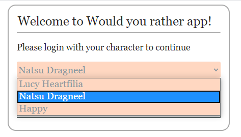
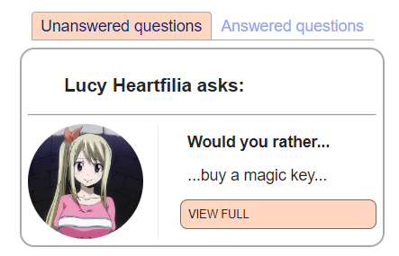
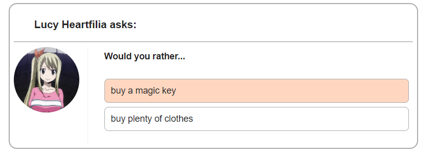
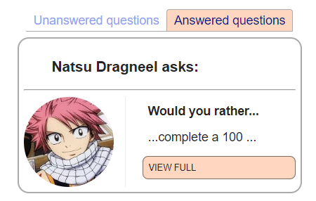
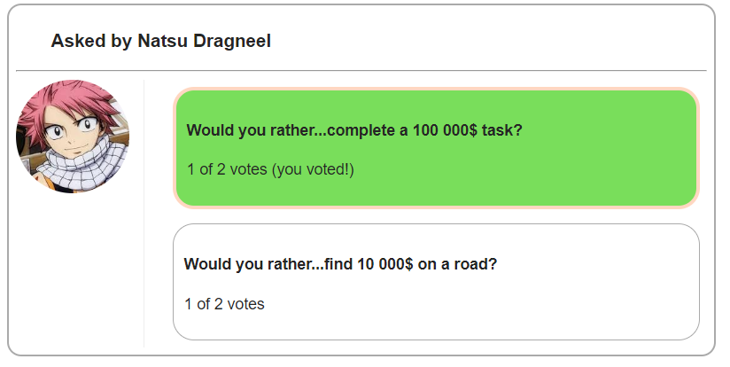
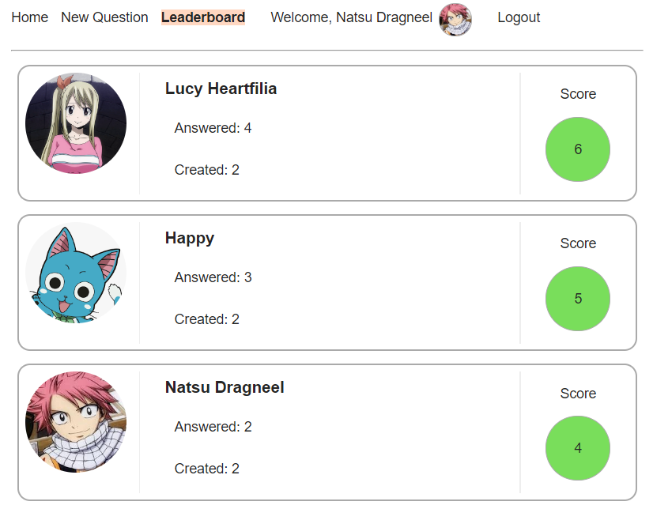

# Would You Rather Project

## Description
This is an application for playing "Would you rather..." game.

## Usage 
First, select one of three available characters to log in:

Home page will open. From here, you can either answer questions by clicking on a "VIEW FULL" button on a question on Unanswered Questions tab:

Or look at the already answered question result:

You can also add a new question:

And check the leaderboard:

To log in with another character, press "Logout" and login again.

## Running the app

To run the project:

* install all project dependencies with `npm install`
* start the development server with `npm start`